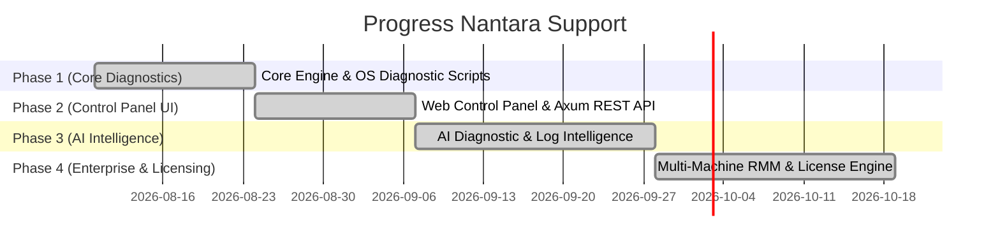

# Roadmap: Nantara Support - AI-Powered IT Support Diagnostic & Control Panel

## 📌 Deskripsi Proyek
Aplikasi otomatisasi diagnostik IT Support dan Control Panel berbasis AI yang dirancang untuk mendeteksi, menganalisis, dan memperbaiki masalah sistem, jaringan, proses, serta hardware secara otomatis maupun melalui tindakan 1-Klik dari Control Panel.

---

## 🎯 Status Proyek & Progress
- **Phase 1 (Core Diagnostics Engine)**: ✅ **SELESAI (100%)**
- **Phase 2 (Web Control Panel & REST API)**: ✅ **SELESAI (100%)**
- **Phase 3 (AI Diagnostic Engine & Log Intelligence)**: ✅ **SELESAI (100%)**
- **Phase 4 (Single-File Exe & Licensing Engine)**: ✅ **SELESAI (100%)**

---

## 🗺️ Visual Roadmap & Progress Chart

---

## 📑 Rincian Progress per Tahapan

### ✅ Phase 1: Core Diagnostics & Local Agent Execution (SELESAI)
*Fokus: Mengotomatiskan semua perintah dasar IT Troubleshooting di tingkat OS.*

* **[x] 1.1. Module Network & Internet Diagnostics**
  - [x] Otomatisasi pemicu: `ipconfig /all`, `ping` gateway & external (8.8.8.8), `tracert`, `nslookup`.
  - [x] Action Script: Reset Network Adapter, Flush DNS (`ipconfig /flushdns`), Release/Renew IP.
* **[x] 1.2. Module Performa & Process Manager**
  - [x] Pembacaan statistik sistem real-time: Penggunaan CPU, RAM, Disk I/O.
  - [x] Otomatisasi pemicu: Deteksi aplikasi boros RAM, `tasklist`, dan penanganan `taskkill /F /PID`.
* **[x] 1.3. Module Perbaikan Sistem & Storage**
  - [x] Eksekutor otomatis perintah OS: `sfc /scannow`, `DISM /Online /Cleanup-Image /RestoreHealth`, `chkdsk`, `gpupdate /force`.
* **[x] 1.4. Module Printer & Peripheral Service**
  - [x] Automated Spooler Repair: Stop Service (`net stop spooler`), pembersihan berkas antrean printer (`%windir%\System32\spool\PRINTERS\*`), Restart Service (`net start spooler`).

---

### ✅ Phase 2: Web Control Panel Dashboard & Agent API (SELESAI)
*Fokus: Membangun antarmuka visual (Dashboard) yang modern, cepat, dan responsif.*

* **[x] 2.1. Agent HTTP / Axum REST API Server**
  - [x] Server HTTP Axum di Rust (Port 3030) dengan middleware CORS & static file server.
  - [x] Endpoints API: `/api/status`, `/api/diagnose/network`, `/api/fix/*`, `/api/process/kill`.
* **[x] 2.2. Web Dashboard Interface (UI/UX)**
  - [x] Telemetri Visual: Grafik CPU/RAM/Disk, Status Badge Agent Online/Offline.
  - [x] **1-Click Repair Action Panel**:
    - [x] 🔘 *Fix Network Connection & Flush DNS*
    - [x] 🔘 *Clear Printer Queue Spooler*
    - [x] 🔘 *Free Up RAM & Kill Hanged Apps*
    - [x] 🔘 *Run System Repair (SFC & DISM)*
    - [x] 🔘 *Force Update Group Policy (`gpupdate`)*
* **[x] 2.3. History & Terminal Execution Logs**
  - [x] Console log real-time di dashboard untuk menampilkan output STDOUT & STDERR dari perintah Windows.

---

### ✅ Phase 3: AI Diagnostic Engine & Natural Language Assistant (SELESAI)
*Fokus: Menanamkan kecerdasan buatan untuk analisis log dan interaksi dengan user.*

* **[x] 3.1. BSOD Minidump & Event Viewer Log Parser**
  - [x] Pembacaan Windows Event Viewer Log kritis (System & Application errors) & pemindaian file `C:\Windows\Minidump`.
  - [x] Analisis log otomatis via AI & penentuan rekomendasi aksi perbaikan.
* **[x] 3.2. Natural Language Helpdesk Chatbot**
  - [x] Widget Chatbot AI di Web Control Panel. Pengguna dapat menjelaskan kendala dengan bahasa santai (*"Komputerku lemot dan gak bisa nge-print"*).
  - [x] Integration Gemini AI REST API + Smart Local Fallback Parser yang menerjemahkan chat menjadi tombol rekomendasi perbaikan 1-Klik.
* **[x] 3.3. Credential Protection & Local Environment**
  - [x] Penyimpanan aman `GEMINI_API_KEY` pada file `.env` lokal (dilindungi oleh `.gitignore`).

---

### ✅ Phase 4: Single-File Executable & Private Key Generator (SELESAI)
*Fokus: Portabilitas 100% single-file .exe dan generator lisensi Pro privat.*

* **[x] 4.1. Single-File Portable Executable (`.exe`)**
  - [x] Seluruh berkas Web UI (`index.html`, `style.css`, `app.js`) di-embed langsung ke dalam `nantara-support.exe` menggunakan `rust-embed`.
  - [x] Aplikasi dapat dipindahkan dan dijalankan di mana saja tanpa folder `web/` terpisah.
* **[x] 4.2. Cryptographic License Verification Engine**
  - [x] Verifikasi signature HMAC-SHA256 untuk memastikan keabsahan lisensi Pro dan tanggal kadaluarsa.
  - [x] UI Badge status lisensi (**COMMUNITY EDITION** vs **👑 PRO LICENSE**) dan Modal Aktivasi Lisensi Pro.
* **[x] 4.3. Private Key Generator CLI Tool**
  - [x] Tool privat lokal di [tools/key-generator](file:///c:/Users/UseR/Documents/SupportTool/tools/key-generator) untuk generate kunci lisensi Pro berbasis nama client & masa berlaku.

---

## 📑 Ringkasan Pemetaan Fitur dari Gambar IT Support

| Masalah di Gambar | Diagnostik Otomatis Software | Solusi / Eksekusi 1-Click Tool | Status Implementasi |
| :--- | :--- | :--- | :--- |
| **Shared Folder Access Denied** | Ping server, verify network connection | Re-authenticate, check AD permissions | ✅ **Selesai (Phase 1/2/3/4)** |
| **Wi-Fi / No Internet** | Run `ipconfig`, `ping`, `tracert`, `nslookup` | Reset Adapter, Flush DNS, Release/Renew IP | ✅ **Selesai (Phase 1/2/3/4)** |
| **Outlook Not Working** | Check port mail server & internet connection | Restart Mail Profile, repair connection | ✅ **Selesai (Phase 1/2/3/4)** |
| **Computer Slow / Freezing** | Check CPU/RAM usage via WMI/sysinfo | `taskkill` frozen app, clear RAM | ✅ **Selesai (Phase 1/2/3/4)** |
| **Printer Not Printing** | Check spooler service status & queue | Clean spooler directory & restart service | ✅ **Selesai (Phase 1/2/3/4)** |
| **Blue Screen (BSOD)** | Read crash minidump & event logs | Run `sfc /scannow` & `DISM` repair | ✅ **Selesai (Phase 3 AI Log Parser)** |
| **Computer Not Turning On** | Health log sebelum mati (telemetri) | Guide Checklist Interaktif | ✅ **Selesai (Phase 3 AI Assistant)** |
